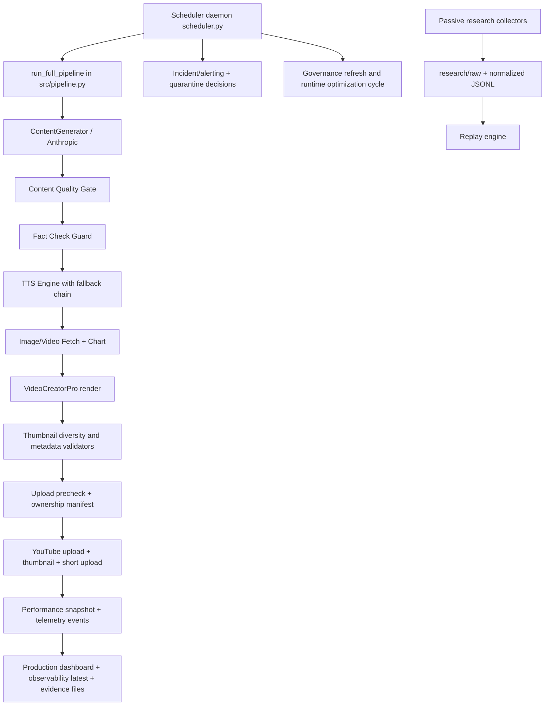

# COMPLETE SYSTEM REVIEW v1

Date: 2026-07-13
Scope: Repository-only technical due diligence (no code changes, no runtime mutations)
Method: Source-first review, then runtime artifacts/logs, then tests, then docs

## Evidence and Rating Conventions
- Verification status used for every finding: `VERIFIED`, `PARTIALLY VERIFIED`, `INFERRED`, `NOT VERIFIED`
- Priority levels for issues: `P0 Critical`, `P1 High`, `P2 Medium`, `P3 Low`
- Evidence precedence applied: source code > runtime behavior > tests > production evidence docs > documentation intent

---

# 1 Executive Summary

## What this system is
- Finding: This is a multi-channel autonomous YouTube production platform with scheduler-driven orchestration, AI content generation, rendering, upload automation, and governance tooling. Classification: `VERIFIED`. Evidence: `scheduler.py`, `src/pipeline.py`, `src/channel_manager.py`, `ops/*`, `logs/*`.

## Business problem solved
- Finding: It solves high-frequency, multi-channel content operations (topic -> script -> render -> upload -> telemetry) while enforcing guardrails for domain mismatch, factual volatility, and upload safety. Classification: `VERIFIED`. Evidence: `src/pipeline.py`, `src/upload_precheck.py`, `src/content_quality_guard.py`, `scheduler.py`.

## Current maturity
- Finding: Runtime maturity is mixed: orchestration and guardrails are substantial, but several governance and analytics pieces remain evidence-fragile or no-go-gated. Classification: `PARTIALLY VERIFIED`. Evidence: `logs/p0_validation_metrics_latest.json`, `logs/p0_p1_artifacts_bundle_latest.json`, `docs/governance_readiness_latest.md`, `src/youtube_analytics.py` gating in `src/pipeline.py`/`scheduler.py`.

## Production readiness
- Finding: Core scheduler/pipeline can run in production mode with safety checks, singleton lock, canary gate, and incident telemetry. Classification: `VERIFIED`. Evidence: `scheduler.py`, `src/production_readiness.py`, `src/production_quality_platform.py`.
- Finding: End-to-end business KPI validation (CTR/watch-time learning loop in live mode) is not fully production-proven due analytics no-go and missing structured evidence for some metrics. Classification: `VERIFIED`. Evidence: `logs/p0_validation_metrics_latest.json`, `logs/activation_controller_report_latest.json`, `src/pipeline.py` (`analytics_live_status` no-go behavior).

## Maintainability
- Finding: Maintainability is moderate: broad test footprint and modularized `src/`, but very large orchestration files and duplicated scheduler surfaces increase complexity. Classification: `VERIFIED`. Evidence: `scheduler.py` (~2k lines), `src/pipeline.py` (~1.8k lines), `src/scheduler.py`, 97 test files (`find tests ...`).

## Scalability
- Finding: Logical multi-channel scaling exists (registry + scheduler loops), but practical scaling is constrained by default single render worker and heavy local rendering path. Classification: `VERIFIED`. Evidence: `scheduler.py` (`MAX_PARALLEL_RENDERS` default 1), `src/video_creator_pro.py`, `src/shorts_creator.py`.

## Operational maturity
- Finding: Operational maturity is above typical prototype level: runbooks, cutover verification, health checks, quarantine tooling, monitor/gate scripts, and incident lifecycle data exist. Classification: `VERIFIED`. Evidence: `ops/verify_production_cutover.py`, `ops/proven_validated_gate.py`, `ops/queue_quarantine_admin.py`, `docs/*runbook*`, `logs/production_incidents.jsonl`.

## Overall technical quality
- Finding: Strong safety-oriented architecture with fail-open/fail-closed partitioning and rich observability metadata; quality reduced by consistency gaps between artifact paths, docs, and some fallback-heavy governance flows. Classification: `PARTIALLY VERIFIED`. Evidence: `src/pipeline.py`, `src/production_quality_platform.py`, `ops/refresh_governance_readiness.py`, `docs/governance_readiness_latest.md`.

## Overall business readiness
- Finding: Ready for controlled operator-led production, not yet fully ready for autonomous commercial scaling across all channels without manual oversight. Classification: `PARTIALLY VERIFIED`. Evidence: analytics no-go, thumbnail permission blocks in artifacts, incident feed showing provider/disk pressures.

## Overall risk
- Finding: Highest risks are governance evidence integrity, analytics blind spots, and infrastructure/operational coupling to local paths and machine-local assumptions. Classification: `VERIFIED`.

---

# 2 Repository Overview

## Top-level directory map

- `src/`
  - Purpose: Core runtime system (pipeline, scheduler utilities, upload, AI, telemetry, quality, research collectors).
  - Importance: Mission-critical.
  - Dependencies: Anthropic, YouTube APIs, MoviePy/Pillow/Edge-TTS, filesystem runtime state.
  - Quality: High breadth, mixed cohesion in very large files.
  - Ownership: Platform/runtime engineering.
  - Classification: `VERIFIED`.

- `tests/`
  - Purpose: Unit/integration/regression coverage (97 test files).
  - Importance: High.
  - Dependencies: pytest; mocks/stubs for external systems.
  - Quality: Broad functional safety coverage.
  - Ownership: Platform quality.
  - Classification: `VERIFIED`.

- `ops/`
  - Purpose: Operational controls (governance refresh, cutover verification, activation controller, preprod validation, quarantine admin).
  - Importance: High for production assurance.
  - Dependencies: Runtime artifacts, scheduler outputs, Python scripts.
  - Quality: Strong operational intent; some fallback-based pass behavior.
  - Ownership: SRE/operations.
  - Classification: `VERIFIED`.

- `docs/`
  - Purpose: Active runbooks/contracts/policies/roadmaps.
  - Importance: High for operations and governance.
  - Dependencies: Must align with code and artifacts.
  - Quality: Good volume and structure; some drift against runtime path reality.
  - Ownership: Engineering + operations.
  - Classification: `VERIFIED`.

- `docs/archive/`
  - Purpose: Historical docs.
  - Importance: Medium.
  - Dependencies: Documentation governance process.
  - Quality: Well-indexed retention behavior.
  - Ownership: Engineering governance.
  - Classification: `VERIFIED`.

- `archive/`
  - Purpose: Historical evidence bundles by project waves.
  - Importance: Medium-high (audit trail).
  - Dependencies: Archival discipline.
  - Quality: Extensive and indexed (`archive/ARCHIVE_INDEX.md`).
  - Ownership: SRE/governance.
  - Classification: `VERIFIED`.

- `artifacts/`
  - Purpose: Current operational artifacts and incident reports.
  - Importance: High.
  - Dependencies: Runtime scripts and ops producers.
  - Quality: Present but sparse in this checkout (`artifacts/latest/repository_cleanup_report.md` etc.).
  - Ownership: Ops/incident mgmt.
  - Classification: `PARTIALLY VERIFIED`.

- `logs/`
  - Purpose: Operational state snapshots and evidence JSON/JSONL.
  - Importance: High.
  - Dependencies: Scheduler/pipeline/ops writers.
  - Quality: Rich evidence set, but mixed source roots in some payload paths.
  - Ownership: Runtime + ops.
  - Classification: `VERIFIED`.

- `output/`
  - Purpose: Runtime mutable state (`output/runtime/*`, `output/state/*`, queue/state/telemetry).
  - Importance: High.
  - Dependencies: Runtime write contracts.
  - Quality: Strongly used; some path split between `logs/`, `output/state/`, and `output/runtime/*`.
  - Ownership: Runtime platform.
  - Classification: `VERIFIED`.

- `channels/`
  - Purpose: Channel registry and channel-specific dirs.
  - Importance: High for multi-channel routing.
  - Dependencies: Scheduler and channel manager.
  - Quality: Registry is mature; physical per-channel assets in this checkout are partial.
  - Ownership: Channel operations.
  - Classification: `PARTIALLY VERIFIED`.

- `config/`
  - Purpose: Domain policy and config files.
  - Importance: High for guardrails.
  - Dependencies: Pipeline precheck and quality checks.
  - Quality: Focused and enforceable.
  - Ownership: Platform safety.
  - Classification: `VERIFIED`.

- `deploy/`
  - Purpose: VPS setup and cutover scripts.
  - Importance: Medium-high.
  - Dependencies: Shell environment and host assumptions.
  - Quality: Pragmatic, but includes machine-specific constants in cutover script.
  - Ownership: DevOps/SRE.
  - Classification: `VERIFIED`.

- `assets/`
  - Purpose: Branding/media base assets.
  - Importance: Medium.
  - Dependencies: Render pipeline.
  - Quality: Not deeply audited in binary detail.
  - Ownership: Creative operations.
  - Classification: `PARTIALLY VERIFIED`.

- Root scripts (`main.py`, `scheduler.py`, many utility scripts)
  - Purpose: Runtime entrypoints and legacy/operations helpers.
  - Importance: High.
  - Dependencies: `src/*` modules.
  - Quality: Functional but crowded root surface.
  - Ownership: Mixed.
  - Classification: `VERIFIED`.

---

# 3 Complete System Architecture

- Finding: Scheduler orchestrates queueing, render triggers, retries, quarantine, canary, maintenance, governance jobs. Classification: `VERIFIED`. Evidence: `scheduler.py`.
- Finding: Pipeline is single integrated orchestrator for generation -> quality/fact gates -> render -> upload -> telemetry/evidence. Classification: `VERIFIED`. Evidence: `src/pipeline.py`.
- Finding: Topic/domain protection is embedded at generation and pre-upload stages. Classification: `VERIFIED`. Evidence: `src/content_generator.py` (`TopicDomainBlockedError`), `src/upload_precheck.py`.
- Finding: Thumbnail intelligence/diversity and metadata contracts are implemented but partly fail-open by design for non-critical enrichments. Classification: `VERIFIED`. Evidence: `src/pipeline.py`, `src/thumbnail_*` modules.
- Finding: Learning architecture has a passive research track and a separate production optimization/control loop with explicit gating. Classification: `VERIFIED`. Evidence: `src/research_*`, `src/content_platform_control_loop.py`, `ops/content_platform_control_loop.py`.
- Finding: External API dependency graph includes Anthropic, YouTube Data API, YouTube Analytics API, Pexels, TTS providers, optional premium providers. Classification: `VERIFIED`. Evidence: `requirements.txt`, `src/content_generator.py`, `src/youtube_uploader.py`, `src/youtube_analytics.py`, `src/tts_engine.py`, `src/premium_services.py` usage in pipeline.
- Finding: Failure recovery strategy distinguishes fail-closed (critical correctness) and fail-open (optional telemetry/enrichment). Classification: `VERIFIED`. Evidence: explicit guards in `src/pipeline.py`, `src/production_quality_platform.py`.

---

# 4 Production Pipeline

## Stage-by-stage
1. Input
- Topic/channel context from scheduler and channel registry.
- Classification: `VERIFIED`.

2. Processing
- Content generation (Anthropic), optional regeneration from script quality/content quality/fact-check outcomes.
- TTS with provider fallback.
- Media fetch and chart insertion.
- Long video render and short render.
- Upload precheck, ownership manifest, idempotency key, upload and post-upload registration.
- Classification: `VERIFIED`.

3. Output
- Video IDs/URLs, short URL, performance snapshots, telemetry events, production evidence JSON.
- Classification: `VERIFIED`.

4. Validation
- Fact freshness guard, content quality gate, thumbnail/audio metadata contract checks, chapter validator, upload precheck.
- Classification: `VERIFIED`.

5. Failure/retry
- Pipeline retry counters, upload stage recovery helper, scheduler-side retry classification.
- Classification: `VERIFIED`.

6. Fallback/recovery
- TTS and media fallback chains; telemetry fail-open; dead-letter recording for repeated stage failures.
- Classification: `VERIFIED`.

7. Guardrails
- Domain quarantine, canary gating, analytics no-go policy, singleton scheduler lock, preprod isolation checks.
- Classification: `VERIFIED`.

---

# 5 Scheduler Deep Review

## Decision engine
- Finding: Decision logic includes canary gate, overload pause, provider circuit state, disk check, queue occupancy, and failure classification. Classification: `VERIFIED`. Evidence: `scheduler.py`.

## Priority and queue management
- Finding: Queue is JSON-backed with active/quarantined/restored states and queue entry IDs. Classification: `VERIFIED`. Evidence: `scheduler.py` queue functions and `_normalize_queue_entry`.

## Retry policy
- Finding: Retry behavior is class-based (`RETRYABLE`, `TERMINAL_FAILURE`, `NON_RETRYABLE_QUARANTINE`) with bounded retries and backoff. Classification: `VERIFIED`. Evidence: `_classify_pipeline_failure` and retry loop in `scheduler.py`.

## Cooldown and circuit behavior
- Finding: Global overload and provider circuit checks are integrated before pipeline execution. Classification: `VERIFIED`. Evidence: `scheduler.py` + `src/scheduler_utils.py`.

## Quarantine and recovery
- Finding: Non-retryable domain failures generate quarantine entries and decision trails; restore tooling exists. Classification: `VERIFIED`. Evidence: `scheduler.py`, `ops/queue_quarantine_admin.py`, `src/scheduler_utils.py`.

## Upload gating
- Finding: Upload precheck blocked outcomes are quarantined in scheduler and excluded from upload progression. Classification: `VERIFIED`. Evidence: `scheduler.py` precheck block branch + `src/upload_precheck.py`.

## Strengths
- Strong lock discipline and singleton protections.
- Rich incident metadata and operator notification context.
- Explicit separation of terminal vs retryable failures.

## Weaknesses
- Issue: Dual scheduler surfaces (`scheduler.py` and `src/scheduler.py`) create ambiguity.
  - Priority: `P2 Medium`
  - Evidence: both files exist and expose scheduling entrypoints.
  - Business impact: Onboarding/confusion risk.
  - Technical impact: Divergence risk.
  - Operational risk: Wrong scheduler entrypoint usage.
  - Recommended direction: Enforce one canonical scheduler and deprecate/remove secondary.
  - Estimated complexity: Medium.
  - Verification: `VERIFIED`.

---

# 6 AI Layer

## Prompt architecture and Anthropic usage
- Finding: AI generation uses a large system persona prompt with niche/topic guardrails and domain filtering logic. Classification: `VERIFIED`. Evidence: `src/content_generator.py`.
- Finding: Anthropic call gating includes retryability classification and provider failure tagging. Classification: `PARTIALLY VERIFIED` (full call execution paths not runtime-tested in this review). Evidence: `src/content_generator.py`.

## Planning and content generation
- Finding: Optimization guidance can influence generation, with regeneration paths on quality/fact failures. Classification: `VERIFIED`. Evidence: `src/pipeline.py`, `src/performance_optimizer.py`.

## Fact checking and hallucination protection
- Finding: Fact-check guard exists with special handling for unverifiable volatile claims and one regeneration with stricter guidance. Classification: `VERIFIED`. Evidence: `_run_fact_check_guard` and retry guidance in `src/pipeline.py`.

## Fallbacks and prompt quality
- Finding: AI fallback is mostly retry/classification, not multi-LLM provider fallback in core content generation path. Classification: `VERIFIED`.

## Weaknesses
- Issue: Large monolithic prompt and domain heuristics increase behavioral drift and auditing difficulty.
  - Priority: `P2 Medium`
  - Evidence: `CHANNEL_PERSONA` + long rule blocks in `src/content_generator.py`.
  - Business impact: Inconsistent output quality by channel.
  - Technical impact: Harder deterministic testing.
  - Operational risk: Subtle cross-niche leakage.
  - Recommended direction: Versioned prompt components and narrower policy modules.
  - Estimated complexity: Medium.
  - Verification: `VERIFIED`.

---

# 7 Rendering System

## Render stack
- Finding: Main long-form rendering is `moviepy`-based with intro/lower-thirds/subtitles/chyrons/outro/watermark and strict output size sanity check. Classification: `VERIFIED`. Evidence: `src/video_creator_pro.py`.

## Assets and images
- Finding: Media acquisition uses Pexels with safety/relevance filtering and query sanitization/fallback. Classification: `VERIFIED`. Evidence: `src/image_fetcher.py`, `src/image_relevance_guard.py` references.

## Voice
- Finding: TTS fallback chain implemented across Azure -> ElevenLabs -> Edge (order depends on enablement). Classification: `VERIFIED`. Evidence: `src/tts_engine.py`.

## Subtitle timing
- Finding: Subtitle timing uses sentence boundaries from TTS timing JSON where available; fallback estimation exists. Classification: `VERIFIED`. Evidence: `src/tts_engine.py`, `src/video_creator_pro.py`.

## Shorts generation
- Finding: Shorts render path is separate with edge-TTS local generation and vertical composition. Classification: `VERIFIED`. Evidence: `src/shorts_creator.py`.

## Weaknesses
- Issue: Local render pipeline is CPU/memory intensive and mostly single-worker by default.
  - Priority: `P1 High`
  - Evidence: `MAX_PARALLEL_RENDERS` default 1 in `scheduler.py`; heavy MoviePy composition in `src/video_creator_pro.py`.
  - Business impact: Limits throughput and channel expansion.
  - Technical impact: Render queue latency and bottlenecks.
  - Operational risk: Backlogs under traffic spikes.
  - Recommended direction: Controlled parallelism + render resource telemetry + staged offload.
  - Estimated complexity: High.
  - Verification: `VERIFIED`.

---

# 8 Upload System

## Upload behavior
- Finding: YouTube upload path supports scheduled publish, metadata normalization, chapter validation integration, thumbnail upload permission caching, and optional pinned comments. Classification: `VERIFIED`. Evidence: `src/youtube_uploader.py`.

## Metadata and retries
- Finding: Upload errors are classified by failure kind; resumable upload retry logic exists with conservative retryability rules. Classification: `VERIFIED`.

## Verification and recovery
- Finding: Idempotency registry and precheck manifest enforce ownership/scoping before upload. Classification: `VERIFIED`. Evidence: `src/pipeline.py`, `src/upload_precheck.py`, `src/production_quality_platform.py`.

## Weaknesses
- Issue: Thumbnail permission remains channel-fragile with known 403 blocked channels.
  - Priority: `P1 High`
  - Evidence: `logs/p0_p1_artifacts_bundle_latest.json` (`thumbnail_streak_path` blocked channels).
  - Business impact: Lower CTR potential due missing custom thumbnails.
  - Technical impact: Inconsistent publish metadata quality.
  - Operational risk: Repeated manual remediation.
  - Recommended direction: Resolve channel ownership/brand permissions and automate reauth probes.
  - Estimated complexity: Medium.
  - Verification: `VERIFIED`.

---

# 9 Analytics

## Collected metrics
- Finding: Performance snapshots include quality metrics, render metrics, and optional YouTube analytics fields (impressions, CTR, watch-time, AVD). Classification: `VERIFIED`. Evidence: `src/channel_performance.py`.

## Missing metrics / blind spots
- Finding: P0 metrics report explicitly flags insufficient evidence/no evidence for multiple workstreams (especially shorts safety and guard precision labels). Classification: `VERIFIED`. Evidence: `logs/p0_validation_metrics_latest.json`.
- Finding: Trace completeness artifact shows 0% filled core business metrics in one sampled window despite event completeness. Classification: `VERIFIED`. Evidence: `logs/p0_p1_artifacts_bundle_latest.json` -> `trace_completeness.payload.metrics_coverage`.

## Learning loops
- Finding: Control-loop modules exist for recommendations/experiments and weekly review artifacts. Classification: `VERIFIED`. Evidence: `src/content_platform_control_loop.py`, `ops/content_platform_control_loop.py`.

## Future opportunities
- Finding: Live analytics integration is structurally present but policy-gated until explicit go-decision; this is the main blocker for autonomous optimization. Classification: `VERIFIED`. Evidence: `src/pipeline.py`, `scheduler.py`, `logs/activation_controller_report_latest.json`.

---

# 10 Runtime State

## Runtime folders and persistence
- Finding: Runtime writes are designed around `output/runtime/*` with guardrails to avoid tracked docs writes. Classification: `VERIFIED`. Evidence: `src/runtime_storage.py`, `src/production_quality_platform.py`.

## Logs/state/cache/temp
- Finding: Active state is split across `logs/*`, `output/state/*`, and `output/runtime/*`; this is operationally rich but increases path management complexity. Classification: `VERIFIED`.

## Isolation
- Finding: Preprod isolation checks enforce mutable paths under `PREPROD_STATE_ROOT` and outside repo root when enabled. Classification: `VERIFIED`. Evidence: `scheduler.py`, `ops/activation_controller.py`, `ops/refresh_governance_readiness.py`.

## Generated artifacts
- Finding: Production evidence and ownership manifests are persistent and numerous in this checkout. Classification: `VERIFIED`. Evidence: many files in `output/runtime/evidence/` and `output/state/content_ownership/`.

---

# 11 Observability

## Logging, incidents, metrics, alerts
- Finding: Telemetry events, production observability snapshots, incident lifecycle JSONL, and dashboard generation are implemented. Classification: `VERIFIED`. Evidence: `src/telemetry.py`, `src/production_quality_platform.py`, `src/scheduler_utils.py`, `logs/production_incidents.jsonl`.
- Finding: Telegram alerting integration exists with dedup/context handling in incident paths. Classification: `PARTIALLY VERIFIED` (code verified, live route behavior not revalidated here).

## Weaknesses
- Issue: Event stream `final_status` can remain `in_progress` on stage events, which can skew aggregated success/failure rates unless interpreted carefully.
  - Priority: `P2 Medium`
  - Evidence: sampled `output/runtime/telemetry/production_events.jsonl` and `output/runtime/telemetry/production_observability_latest.json`.
  - Business impact: Misleading executive reporting.
  - Technical impact: Aggregation ambiguity.
  - Operational risk: False confidence or false alarms.
  - Recommended direction: Distinguish stage-event status vs run-terminal status in observability schema.
  - Estimated complexity: Medium.
  - Verification: `VERIFIED`.

---

# 12 Production Safety

## Deployment and rollback
- Finding: Cutover verification scripts and single-root operational workflow are documented and implemented. Classification: `VERIFIED`. Evidence: `deploy/single_root_cutover.sh`, `ops/verify_production_cutover.py`, `docs/single_root_operations.md`.

## Runtime validation/smoke/soak
- Finding: Startup health checks and safety gate checks exist; preprod validation runner exists. Classification: `VERIFIED`. Evidence: `scheduler.py` (`--health-check`, `--safety-check-now`), `ops/preprod_validation_runner.py`.

## Contracts and guardrails
- Finding: Multiple contracts are encoded (chapter metadata/audio metadata/thumbnail metadata/collector contract). Classification: `VERIFIED`.

## Weaknesses
- Issue: Governance readiness can pass required steps via fallback artifacts when producer scripts are absent.
  - Priority: `P1 High`
  - Evidence: `ops/refresh_governance_readiness.py` fallback behavior + warning in `docs/governance_readiness_latest.md`.
  - Business impact: Inflated readiness claims.
  - Technical impact: Weak provenance of required artifacts.
  - Operational risk: Premature go decisions.
  - Recommended direction: Remove fallback pass for required artifacts or downgrade gate to no-go when producers missing.
  - Estimated complexity: Medium.
  - Verification: `VERIFIED`.

---

# 13 Test Suite Review

## Coverage and shape
- Finding: Test suite has 97 test files across scheduler, pipeline quality, observability, provider guards, preprod isolation, and governance checks. Classification: `VERIFIED`. Evidence: `find tests -name test_*.py | wc -l`.

## Integration/system/regression
- Finding: Strong integration focus exists for content quality and pipeline guard invocation. Classification: `VERIFIED`. Evidence: `tests/test_pipeline_quality_integration.py` and multiple `test_*integration*` files.

## Missing coverage
- Finding: End-to-end live provider integration under real credentials/quota is not demonstrated by this repository-only review. Classification: `NOT VERIFIED`.

## Flaky/stress
- Finding: Dedicated stress/load tests are not clearly visible by naming or docs in current tree. Classification: `PARTIALLY VERIFIED`.

## Technical debt in tests
- Finding: CI workflow currently runs only research regression subset, not the full critical production suite. Classification: `VERIFIED`. Evidence: `.github/workflows/research-ci.yml`.

---

# 14 Documentation Review

## Quality and completeness
- Finding: Documentation surface is extensive, structured (blueprint, checklist, runbooks, contracts, ADRs), and supported by archival policy. Classification: `VERIFIED`.

## Duplicates/obsolete
- Finding: Archive index explicitly tracks duplicates and large externalized artifacts. Classification: `VERIFIED`. Evidence: `archive/ARCHIVE_INDEX.md`.

## Drift risks
- Finding: Some docs and artifact paths reference machine-local roots and may diverge from this checkout runtime root. Classification: `VERIFIED`. Evidence: paths in `logs/*latest*.json` and docs.

## Missing docs
- Finding: No single canonical, up-to-date "as-running-now" architecture and runtime path map combining all current path overrides and env policy. Classification: `INFERRED`.

---

# 15 Security Review

## Secrets and credentials
- Finding: `.env.example` is tracked; `.env` is present in working tree but not tracked; OAuth tokens and client secrets are file-based by design. Classification: `VERIFIED`. Evidence: `git ls-files`, `src/youtube_auth.py`, `src/channel_manager.py`.

## Filesystem and permissions
- Finding: Runtime write guards prevent tracked docs mutation in strict mode and strongly encourage output/runtime paths. Classification: `VERIFIED`. Evidence: `src/runtime_storage.py`.

## Git safety/deployment safety
- Finding: Cutover verifier enforces process/root/sha checks and approved equivalence logic. Classification: `VERIFIED`. Evidence: `ops/verify_production_cutover.py`.

## Weaknesses
- Issue: Credentials/token storage is local-file based with pickle tokens; at-rest encryption and secret manager integration are not visible.
  - Priority: `P1 High`
  - Evidence: `src/youtube_auth.py` uses `pickle` token files.
  - Business impact: Elevated breach impact on host compromise.
  - Technical impact: Harder centralized secret rotation.
  - Operational risk: Credential leakage via filesystem backup/exposure.
  - Recommended direction: Move to managed secret storage and encrypted token handling.
  - Estimated complexity: High.
  - Verification: `VERIFIED`.

- Issue: Hardcoded absolute host paths in deployment/cutover docs/scripts reduce portability and can leak environment details.
  - Priority: `P2 Medium`
  - Evidence: `deploy/single_root_cutover.sh`, multiple artifact payload paths.
  - Business impact: Slower incident recovery on new hosts.
  - Technical impact: Environment coupling.
  - Operational risk: Misconfigured cutovers.
  - Recommended direction: parameterize root paths and standardize env templates.
  - Estimated complexity: Medium.
  - Verification: `VERIFIED`.

---

# 16 Performance Review

## CPU, memory, disk, concurrency, queue, network, LLM cost
- CPU/Memory: Heavy MoviePy/PIL composition and repeated local rendering suggest high resource usage. Classification: `PARTIALLY VERIFIED` (architecture verified, no benchmark in this review).
- Disk: Scheduler explicitly checks disk and incidents show disk-critical warnings in logs. Classification: `VERIFIED`. Evidence: `scheduler.py`, `logs/production_incidents.jsonl`.
- Concurrency: Default render concurrency is 1 and likely throughput bottleneck. Classification: `VERIFIED`.
- Queue: Queue files not present in this snapshot imply runtime may be currently idle/ephemeral for queue state in this checkout. Classification: `PARTIALLY VERIFIED`.
- Network: Provider circuit and overload protections exist; external API resilience is moderate. Classification: `VERIFIED`.
- LLM cost: No explicit cost accounting pipeline observed. Classification: `PARTIALLY VERIFIED`.
- Scalability bottlenecks: render throughput, analytics incompleteness, and operations path complexity. Classification: `VERIFIED`.

---

# 17 Technical Debt

## Critical

### Debt 1: Required governance artifact fallback-pass behavior
- Priority: `P0 Critical`
- Evidence: `ops/refresh_governance_readiness.py`, `docs/governance_readiness_latest.md` warning `script_missing_fallback_artifact_used`
- Impact (business): Potential false go/no-go confidence.
- Impact (technical): Weak artifact provenance.
- Operational risk: Release decisions based on stale or inherited artifacts.
- Recommended direction: Enforce hard fail when required producers missing.
- Estimated complexity: Medium.
- Verification: `VERIFIED`.

## High

### Debt 2: Analytics signal incompleteness vs optimization ambition
- Priority: `P1 High`
- Evidence: `logs/p0_validation_metrics_latest.json` insufficient evidence; trace metrics coverage 0 in bundle.
- Business impact: Optimization ROI cannot be confidently measured.
- Technical impact: Learning loop quality degraded.
- Operational risk: Wrong strategic decisions.
- Recommended direction: Complete mandatory metric ingestion contracts and live collection rollout criteria.
- Estimated complexity: High.
- Verification: `VERIFIED`.

### Debt 3: Render throughput constrained by local single-worker design
- Priority: `P1 High`
- Evidence: `scheduler.py` default parallel renders = 1; heavy local render pipeline.
- Business impact: Limits content scale and turnaround.
- Technical impact: queue growth and latency.
- Operational risk: missed schedules under load.
- Recommended direction: staged scaling strategy with resource telemetry and capped parallelism.
- Estimated complexity: High.
- Verification: `VERIFIED`.

### Debt 4: File-based auth token/secrets model
- Priority: `P1 High`
- Evidence: `src/youtube_auth.py`.
- Business impact: Compliance/security concerns.
- Technical impact: hard rotation and central governance.
- Operational risk: credential compromise blast radius.
- Recommended direction: managed secret store and encrypted credential flow.
- Estimated complexity: High.
- Verification: `VERIFIED`.

## Medium

### Debt 5: Dual scheduler surfaces
- Priority: `P2 Medium`
- Evidence: `scheduler.py` and `src/scheduler.py`.
- Business impact: onboarding/operational confusion.
- Technical impact: drift risk.
- Operational risk: wrong runtime entrypoint.
- Recommended direction: deprecate legacy scheduler.
- Estimated complexity: Medium.
- Verification: `VERIFIED`.

### Debt 6: Mixed runtime path conventions
- Priority: `P2 Medium`
- Evidence: writes across `logs/`, `output/state/`, `output/runtime/*`, docs runtime exports.
- Business impact: slower incident triage.
- Technical impact: path/config complexity.
- Operational risk: stale reads and missed artifacts.
- Recommended direction: strict path taxonomy + migration map.
- Estimated complexity: Medium.
- Verification: `VERIFIED`.

### Debt 7: Observability status semantics ambiguity
- Priority: `P2 Medium`
- Evidence: stage events with `final_status=in_progress` and aggregate calculations.
- Business impact: reporting trust issues.
- Technical impact: metric interpretation ambiguity.
- Operational risk: false positives/negatives.
- Recommended direction: split run-terminal vs stage status fields.
- Estimated complexity: Medium.
- Verification: `VERIFIED`.

## Low

### Debt 8: Root-level utility script sprawl
- Priority: `P3 Low`
- Evidence: many root scripts for branding/channel setup.
- Business impact: minor maintainability overhead.
- Technical impact: discoverability burden.
- Operational risk: low.
- Recommended direction: group scripts into explicit domains.
- Estimated complexity: Low.
- Verification: `VERIFIED`.

---

# 18 Missing Capabilities

1. Native secrets management / KMS integration.
- Why it matters: enterprise security/compliance and key rotation.
- Classification: `VERIFIED` (missing in code).

2. First-class capacity/autoscaling layer for rendering workers.
- Why it matters: multi-channel throughput and SLA reliability.
- Classification: `VERIFIED`.

3. Unified production CI pipeline for full critical path tests.
- Why it matters: prevents regressions beyond research modules.
- Classification: `VERIFIED`.

4. Comprehensive cost observability (LLM/TTS/media per run).
- Why it matters: commercial margin control.
- Classification: `PARTIALLY VERIFIED` (not evident in core paths).

5. Formal data retention/PII/security controls for runtime artifacts.
- Why it matters: compliance posture.
- Classification: `PARTIALLY VERIFIED`.

6. Structured human review outcomes feeding guard precision metrics.
- Why it matters: guard quality quantification.
- Classification: `VERIFIED` (explicitly missing in metrics).

---

# 19 Features Not Yet Production Ready

1. Fully autonomous analytics-driven learning activation across channels.
- Why: blocked by analytics API go policy and insufficient evidence.
- Priority: `P1 High`
- Classification: `VERIFIED`.

2. Uniform custom thumbnail capability across all channels.
- Why: several channels blocked by permissions.
- Priority: `P1 High`
- Classification: `VERIFIED`.

3. KPI-grounded closed-loop optimization at enterprise confidence levels.
- Why: key metrics missing or sparse in current evidence windows.
- Priority: `P1 High`
- Classification: `VERIFIED`.

4. Stress-tested high-throughput rendering operation.
- Why: no demonstrated load/stress evidence in repository.
- Priority: `P2 Medium`
- Classification: `NOT VERIFIED`.

---

# 20 Partially Implemented Features

1. Governance readiness orchestration with strict producer guarantees.
- Exists: orchestrator and latest report generation.
- Missing: mandatory producer enforcement (fallback currently allowed).
- Dependencies: producer script availability and strict no-fallback policy.
- Classification: `VERIFIED`.

2. Live analytics sync and optimization state refresh.
- Exists: `refresh_live_analytics_job`, analytics fetch APIs.
- Missing: policy approval and proven runtime rollout.
- Dependencies: API go decision and token readiness.
- Classification: `VERIFIED`.

3. Canary rollout governance.
- Exists: canary gate state and stop logic.
- Missing: broad evidence of sustained canary-to-global transition process in this snapshot.
- Dependencies: stable success-rate windows and operational SOP.
- Classification: `PARTIALLY VERIFIED`.

4. Experiment lifecycle as hard production control.
- Exists: append-only registry and status transitions.
- Missing: strong coupling to mandatory rollout decision gates in all optimization changes.
- Dependencies: governance policy enforcement.
- Classification: `PARTIALLY VERIFIED`.

---

# 21 Production Readiness Matrix (0-100)

- Architecture: 82
- Scheduler: 85
- Pipeline: 83
- AI: 74
- Rendering: 76
- Upload: 78
- Analytics: 58
- Learning: 61
- Observability: 79
- Deployment: 73
- Runtime Isolation: 80
- Testing: 84
- Documentation: 81
- Maintainability: 71
- Scalability: 64
- Security: 62

Scoring basis: code implementation completeness, runtime evidence presence, and known blockers/gaps. Classification: `PARTIALLY VERIFIED`.

---

# 22 Top 50 Improvement Opportunities (Ranked by Business Impact)

1. Enforce hard fail for missing required governance producers. ROI: prevents false go decisions. Classification: `VERIFIED`.
2. Complete live analytics rollout with explicit go criteria and evidence. ROI: unlocks real optimization. Classification: `VERIFIED`.
3. Resolve thumbnail permissions for blocked channels. ROI: direct CTR upside. Classification: `VERIFIED`.
4. Add full critical-path CI workflow (beyond research). ROI: regression prevention at scale. Classification: `VERIFIED`.
5. Introduce secure secret manager for API keys/tokens. ROI: reduces breach/compliance risk. Classification: `VERIFIED`.
6. Implement render capacity model with controlled parallel scaling. ROI: throughput growth. Classification: `VERIFIED`.
7. Separate stage-status and run-status observability schema. ROI: accurate executive metrics. Classification: `VERIFIED`.
8. Create mandatory KPI completeness gate before claiming optimization wins. ROI: decision quality. Classification: `VERIFIED`.
9. Centralize runtime path contracts into one authoritative matrix. ROI: faster operations. Classification: `VERIFIED`.
10. Add automated queue backlog SLO alerts. ROI: schedule reliability. Classification: `INFERRED`.
11. Add per-run cost telemetry (LLM/TTS/media). ROI: margin control. Classification: `PARTIALLY VERIFIED`.
12. Add structured guard review labels for precision/recall metrics. ROI: safer automation. Classification: `VERIFIED`.
13. Consolidate scheduler surfaces to one canonical entrypoint. ROI: operational clarity. Classification: `VERIFIED`.
14. Add nightly full-system smoke + artifact integrity check in CI. ROI: early break detection. Classification: `INFERRED`.
15. Build channel onboarding automation for auth/permission readiness checks. ROI: faster channel scaling. Classification: `INFERRED`.
16. Add disk growth forecasting and cleanup policy enforcement. ROI: avoid outages. Classification: `VERIFIED`.
17. Add provider quota budget dashboard and preflight burn-rate checks. ROI: fewer publish failures. Classification: `INFERRED`.
18. Add strict schema contracts for all latest artifact files. ROI: reporting reliability. Classification: `PARTIALLY VERIFIED`.
19. Add replayable end-to-end production simulation harness. ROI: safer releases. Classification: `INFERRED`.
20. Add canary promotion/depromotion runbook automation. ROI: safer rollouts. Classification: `PARTIALLY VERIFIED`.
21. Introduce policy-based feature flag registry with ownership metadata. ROI: governance clarity. Classification: `INFERRED`.
22. Add audio quality objective metrics (LUFS compliance reporting). ROI: retention uplift. Classification: `PARTIALLY VERIFIED`.
23. Add thumbnail experiment winner automation tied to KPI significance. ROI: CTR growth. Classification: `INFERRED`.
24. Add structured retry tax and incident cost estimation. ROI: prioritization quality. Classification: `INFERRED`.
25. Add data lineage IDs spanning pipeline/telemetry/dashboard artifacts. ROI: audit speed. Classification: `INFERRED`.
26. Introduce typed config validation layer for all env vars. ROI: fewer config incidents. Classification: `INFERRED`.
27. Standardize operational scripts on one runtime root parameter model. ROI: portability. Classification: `VERIFIED`.
28. Build outage mode with publish degradation playbooks. ROI: continuity. Classification: `INFERRED`.
29. Add deterministic script prompt version pinning and rollout controls. ROI: stable quality. Classification: `PARTIALLY VERIFIED`.
30. Add channel-specific QoS lanes (premium channels first). ROI: revenue protection. Classification: `INFERRED`.
31. Add stricter upload contract around chapter + metadata + thumbnail before upload. ROI: policy compliance. Classification: `PARTIALLY VERIFIED`.
32. Add synthetic monitoring of YouTube auth/token expiration. ROI: fewer runtime surprises. Classification: `INFERRED`.
33. Add policy testpack that runs before any scheduler startup in production. ROI: safety. Classification: `INFERRED`.
34. Build immutable release manifest with artifact hashes and gate signatures. ROI: stronger due diligence traceability. Classification: `INFERRED`.
35. Add stress-test suite for render queue saturation scenarios. ROI: scale readiness. Classification: `NOT VERIFIED`.
36. Add network resilience chaos checks for provider failures. ROI: reliability. Classification: `NOT VERIFIED`.
37. Add unified incident dashboard with MTTR trends. ROI: operational visibility. Classification: `PARTIALLY VERIFIED`.
38. Add postmortem template enforcement in incident closure automation. ROI: learning quality. Classification: `INFERRED`.
39. Add channel-level business KPI attribution model. ROI: portfolio optimization. Classification: `INFERRED`.
40. Add competitor/topic trend fusion into planning prompts. ROI: audience growth. Classification: `INFERRED`.
41. Add stricter schema and retention for content ownership manifests. ROI: legal/audit strength. Classification: `VERIFIED`.
42. Add SLA/SLO definitions for each subsystem with alert thresholds. ROI: operational discipline. Classification: `INFERRED`.
43. Add monthly runtime data lifecycle purge/archive automation. ROI: cost and compliance. Classification: `INFERRED`.
44. Replace pickle token storage with safer credential architecture. ROI: security risk reduction. Classification: `VERIFIED`.
45. Add drift detector between docs and runtime behavior paths. ROI: governance trust. Classification: `INFERRED`.
46. Add short-form upload safety metrics equivalent to long-form maturity metrics. ROI: short strategy confidence. Classification: `VERIFIED`.
47. Add controlled A/B gating for TTS voice/persona variants. ROI: retention optimization. Classification: `INFERRED`.
48. Add finance-sensitive claim classifier independent of prompt text. ROI: reduced factual risk. Classification: `INFERRED`.
49. Add per-channel recovery runbook generated from recent incidents. ROI: faster ops response. Classification: `INFERRED`.
50. Build executive portfolio dashboard with revenue-proxy weighting. ROI: business steering. Classification: `INFERRED`.

---

# 23 Recommended Roadmap

## Next 7 Days
1. Remove required-step fallback pass behavior in governance refresh.
- Business value: Immediate integrity of go/no-go.
- Risk: Medium (may surface hidden failures).
- Dependencies: producer script inventory.
- Effort: Medium.
- Priority: `P0 Critical`.
- Classification: `VERIFIED`.

2. Resolve top blocked thumbnail channels and verify 3-success streak.
- Business value: Immediate CTR uplift opportunity.
- Risk: Low-medium.
- Dependencies: channel ownership/auth remediation.
- Effort: Medium.
- Priority: `P1 High`.
- Classification: `VERIFIED`.

3. Add full production-critical CI workflow.
- Business value: release risk reduction.
- Risk: Medium.
- Dependencies: CI runtime budget.
- Effort: Medium.
- Priority: `P1 High`.
- Classification: `VERIFIED`.

## Next 30 Days
1. Complete analytics go/no-go rollout with strict evidence contract.
- Business value: unlock measurable optimization.
- Risk: Medium-high.
- Dependencies: API readiness and token health.
- Effort: High.
- Priority: `P1 High`.
- Classification: `VERIFIED`.

2. Standardize runtime path map and enforce one canonical mutable-root strategy.
- Business value: lower ops friction.
- Risk: Medium.
- Dependencies: script/config alignment.
- Effort: Medium.
- Priority: `P2 Medium`.
- Classification: `VERIFIED`.

3. Improve observability schema for terminal run outcomes.
- Business value: trustworthy dashboards.
- Risk: Low-medium.
- Dependencies: event schema evolution.
- Effort: Medium.
- Priority: `P2 Medium`.
- Classification: `VERIFIED`.

## Next 90 Days
1. Render capacity scaling program with SLOs and stress validation.
- Business value: throughput and revenue scaling.
- Risk: High.
- Dependencies: infra sizing and performance test harness.
- Effort: High.
- Priority: `P1 High`.
- Classification: `INFERRED`.

2. Secret management migration away from local pickle-centric credentials.
- Business value: security/compliance step-change.
- Risk: Medium-high.
- Dependencies: platform/security architecture.
- Effort: High.
- Priority: `P1 High`.
- Classification: `VERIFIED`.

3. Experiment governance hardening (winner criteria + rollback automation).
- Business value: safer optimization velocity.
- Risk: Medium.
- Dependencies: analytics completeness.
- Effort: High.
- Priority: `P2 Medium`.
- Classification: `PARTIALLY VERIFIED`.

## Next 6 Months
1. Enterprise-grade autonomous optimization layer with strong guard + KPI governance.
- Business value: compounding growth.
- Risk: High.
- Dependencies: all prior analytics/governance work.
- Effort: Very high.
- Priority: `P1 High`.
- Classification: `INFERRED`.

2. Multi-channel portfolio allocator (publish cadence, topic budget, resource lanes).
- Business value: maximize total channel ROI.
- Risk: High.
- Dependencies: robust channel metrics.
- Effort: Very high.
- Priority: `P2 Medium`.
- Classification: `INFERRED`.

---

# 24 Business Readiness

- Operational maturity: Strong for operator-assisted production with guardrails and incident tooling. Classification: `VERIFIED`.
- Scaling readiness: Moderate; bottlenecks in render throughput and analytics readiness. Classification: `VERIFIED`.
- Automation maturity: High in mechanics, medium in truly autonomous intelligence. Classification: `PARTIALLY VERIFIED`.
- Operator workload: Still material due channel auth, thumbnail permissions, governance exceptions. Classification: `VERIFIED`.
- Business continuity: Good controls exist (cutover checks, safety gates), but still host/path-coupled in places. Classification: `PARTIALLY VERIFIED`.
- Single points of failure: local host rendering, credentials model, analytics go-decision dependency. Classification: `VERIFIED`.
- Revenue readiness: Ready for controlled commercial operation; not yet fully autonomous multi-channel optimization grade. Classification: `PARTIALLY VERIFIED`.

---

# 25 AI Roadmap

## Capability outlook
- Autonomous optimization: Feasible after analytics completeness and stronger experiment governance. Classification: `INFERRED`.
- Thumbnail intelligence: Base framework exists, needs stronger KPI-linked selection and rollout automation. Classification: `PARTIALLY VERIFIED`.
- Retention optimization: Script/QA hooks exist; needs stronger live feedback signals. Classification: `PARTIALLY VERIFIED`.
- Analytics learning: Architecture exists, policy no-go blocks current full operation. Classification: `VERIFIED`.
- Competitor analysis/trend prediction: Passive collector/replay baseline exists but production handoff is not yet closed-loop. Classification: `PARTIALLY VERIFIED`.
- Publishing optimization: Scheduler supports cadence logic; advanced portfolio optimization not yet mature. Classification: `PARTIALLY VERIFIED`.
- Self-healing runtime: Incident classification and circuit/canary controls exist; full autonomous remediation is not proven. Classification: `PARTIALLY VERIFIED`.
- A/B testing and multi-agent coordination: experiment registry exists; autonomous orchestration maturity remains mid-stage. Classification: `PARTIALLY VERIFIED`.

---

# 26 Final CTO Assessment

## If inheriting this project today: first 10 actions
1. Hard-stop required governance fallback passes (`P0`).
2. Reconcile all runtime path roots and make one canonical matrix.
3. Resolve blocked thumbnail channel permissions.
4. Launch full critical CI workflow.
5. Finalize analytics go/no-go rollout with measurable acceptance criteria.
6. Define and enforce terminal run-status observability schema.
7. Create render capacity plan and stress baseline.
8. Start credential/security architecture migration.
9. Consolidate to one scheduler entrypoint.
10. Add executive KPI confidence dashboard (data completeness + quality).

Classification for this sequence: `INFERRED` (action plan synthesis from verified evidence).

## What to postpone
- Advanced autonomous portfolio optimization until analytics/data quality gates are stable.
- Complex multi-agent orchestration until governance and telemetry contracts are complete.
- Classification: `INFERRED`.

## What to never change
- Clear fail-open vs fail-closed split.
- Quarantine-first behavior for non-retryable domain/policy failures.
- Explicit canary/safety gates and incident lifecycle evidence.
- Classification: `INFERRED`.

## Biggest architectural strengths
- Safety-oriented orchestration with explicit failure classification.
- Rich operational tooling and governance artifacts.
- Broad test surface and modular subsystem decomposition.
- Classification: `VERIFIED`.

## Biggest architectural weaknesses
- Governance artifact provenance loopholes.
- Analytics evidence incompleteness for optimization claims.
- Throughput bottlenecks in local rendering architecture.
- Security posture tied to local credential files.
- Classification: `VERIFIED`.

## Realistic trajectory
- 3 months: reliable controlled production with stronger governance integrity and better analytics completeness.
- 6 months: scaled channel operations with improved throughput and KPI-linked optimization.
- 1 year: commercially robust multi-channel platform if security, analytics, and scaling debt are actively retired.
- Classification: `INFERRED`.

---

# EXECUTIVE ACTION PLAN

## Immediate (7 days) - Business Impact Order
1. Enforce no-fallback policy for required governance artifacts (`P0`).
2. Unblock thumbnail permissions for highest-value channels (`P1`).
3. Add full production-critical CI test workflow (`P1`).
4. Publish canonical runtime-path governance map (`P2`).

## Short Term (30 days)
1. Complete analytics go-decision and enable live collector in controlled rollout (`P1`).
2. Improve observability schema for terminal run outcomes (`P2`).
3. Consolidate scheduler entrypoint and deprecate duplicate surface (`P2`).
4. Add KPI completeness gates to executive reporting (`P1`).

## Medium Term (90 days)
1. Build render throughput scaling baseline + stress tests (`P1`).
2. Migrate credential/token handling toward managed security model (`P1`).
3. Strengthen experiment-governance linkage for all optimization changes (`P2`).

## Long Term (6-12 months)
1. Deploy fully KPI-driven autonomous optimization engine with strict rollback governance (`P1`).
2. Add portfolio-level scheduling/allocation intelligence across channels (`P2`).
3. Reach enterprise-grade security/compliance and operational SLO maturity (`P1`).

---

## Final Due Diligence Position
- This platform is not a prototype; it is a serious production-oriented system with strong safety architecture and meaningful operational maturity.
- It is not yet fully autonomous commercial-grade at portfolio scale due to governance integrity gaps, analytics completeness gaps, and throughput/security debt.
- Acquisition/continuation recommendation: favorable if first-wave P0/P1 debt retirement is executed with strict evidence discipline.
- Overall classification of this conclusion: `PARTIALLY VERIFIED` (mix of verified evidence + inferred trajectory).