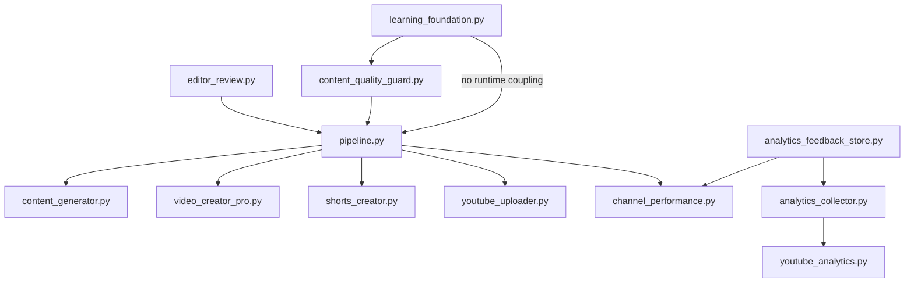

# PROJECT 001 - Slice 3 Phase 1 Architecture Map

## Scope

This document captures the current generation-to-upload-to-analytics pipeline map and defines the non-invasive Slice 3 Phase 1 foundation. The target of Phase 1 is architecture, schema, and deterministic quality-learning primitives only.

No production runtime behavior changes are introduced by this phase.

## Current Pipeline Evidence Map

### 1. Generation and Content Shaping

- Main orchestration: src/pipeline.py
- Topic and script generation: src/content_generator.py
- Content model: VideoContent dataclass in src/content_generator.py
- SEO description shaping: VideoContent.seo_description in src/content_generator.py

Current artifacts produced:
- title
- description
- tags
- script
- hook
- next_video_teaser
- thumbnail_prompt
- pexels_search
- chart_data
- prompt_metadata
- channel_dna_metadata
- quality_score_metadata

### 2. Rendering and Shorts

- Long-form rendering: src/video_creator_pro.py
- Shorts extraction and vertical rendering: src/shorts_creator.py

Current artifacts produced:
- long-form video file
- short-form video file
- thumbnail image
- render metrics and runtime status metadata

### 3. Upload and Publish Metadata

- Upload and metadata normalization: src/youtube_uploader.py
- Playlist manager helper: src/playlist_manager.py
- Capability gating integration: src/channel_capabilities.py and src/youtube_uploader.py

Current artifacts produced:
- uploaded video id
- optional short id
- normalized description/tags/chapter-safe description
- optional thumbnail upload
- optional comments flow

### 4. Performance and Analytics Surfaces

- Daily performance snapshot: src/channel_performance.py
- Analytics collector normalization: src/analytics_collector.py
- YouTube analytics adapter: src/youtube_analytics.py
- Review metadata scoring: src/editor_review.py
- Content quality gate: src/content_quality_guard.py

Current artifacts produced:
- channel performance JSONL snapshots
- evaluator-compatible analytics rows
- deterministic review metadata and quality signals

## Slice 3 Phase 1 Gaps (Observed)

1. No single canonical analytics feedback schema containing full lifecycle attributes (content hash + traffic + engagement + retention fields).
2. No append-only dedicated feedback log abstraction with strict payload validation.
3. No central checkpoint evaluator that scores cross-stage consistency in one deterministic pass.
4. Duplicate/repetition logic exists in partial places but not as a dedicated reusable quality-learning primitive for title/script/thumbnail/CTA repetition checks.
5. No explicit recommendation and learning signal serialization layer to feed later feedback loops.

## Phase 1 Foundation Additions

### New Modules

- src/learning_foundation.py
- src/analytics_feedback_store.py

### New Test Coverage

- tests/test_learning_foundation.py
- tests/test_analytics_feedback_store.py

## Foundation Design

### A. Quality Checkpoint System (Read-Only)

Entry point:
- evaluate_quality_checkpoints in src/learning_foundation.py

Implemented checkpoint scores:
- title_script_semantic_consistency
- title_thumbnail_consistency
- script_description_consistency
- script_shorts_consistency
- thumbnail_video_consistency
- hook_quality
- duplicate_script_detection
- repetitive_opening_detection
- repeated_cta_detection
- duplicate_thumbnail_text_detection
- duplicate_title_detection
- unsupported_financial_claim_detection
- unverifiable_insider_information_detection
- guaranteed_return_wording_detection

Design constraints:
- deterministic scoring
- no prompt mutation
- no pipeline mutation
- no outbound API dependency

### B. Duplicate and Semantic Helpers

Implemented primitives in src/learning_foundation.py:
- tokenize_text
- semantic_similarity_score
- content_hash
- detect_duplicate_text
- detect_repetitive_opening
- detect_repeated_cta

These are simple, deterministic baselines suitable for Phase 1. Advanced embedding-based comparison is deferred to later phases.

### C. Risk Phrase Detection (Content Safety Foundation)

Implemented phrase detectors:
- detect_unsupported_financial_claims
- detect_unverifiable_insider_information
- detect_guaranteed_return_wording

Purpose:
- produce machine-readable fail signals for future editor/auto-review workflows
- preserve current production behavior (no direct blocking integration in this phase)

### D. Analytics Feedback Schema + Storage

Implemented in src/analytics_feedback_store.py:
- AnalyticsFeedbackRecord dataclass
- validate_feedback_payload
- make_feedback_record
- append_feedback_record
- load_feedback_records

Schema includes:
- identity: channel_id, video_id, title, topic
- content hashes: thumbnail_hash, script_hash, shorts_hash
- performance: impressions, ctr, average view duration, percentage viewed
- retention: audience_retention map
- engagement: likes, comments, shares, subscribers_gained
- traffic: traffic_sources, suggested, browse, search
- conversion-like metadata: end_screen_ctr, card_ctr, playlist_additions
- timestamps: upload_timestamp, recorded_at

Storage properties:
- append-only JSONL
- strict validation before write
- strict validation on read

## Dependency Graph (Phase 1)

Interpretation:
- New Slice 3 modules are add-on foundation layers.
- Existing pipeline remains source of truth for runtime flow.
- Integration into runtime loop is planned for later phases after evidence thresholds.

## Hardening and Validation Notes

Implemented validation tests cover:
- model serialization
- semantic similarity and hash normalization
- duplicate/repetition detection
- risky phrase detector behavior
- validator result structure
- feedback schema validation success/failure
- append-only write and load roundtrip

## Maturity State

- PLANNED: Full closed-loop optimization that auto-adjusts prompt/channel strategy from live metrics.
- REPORTED: Architecture map and foundation modules/tests documented and present.
- PROVEN: Requires runtime artifacts showing this foundation executed in production paths.
- VALIDATED: Requires sustained production evidence across channels and periods.
- ROLLED_OUT: Requires controlled rollout with incident-free operation and acceptance criteria closure.

Current state for Slice 3 Phase 1: REPORTED (local code + tests).
