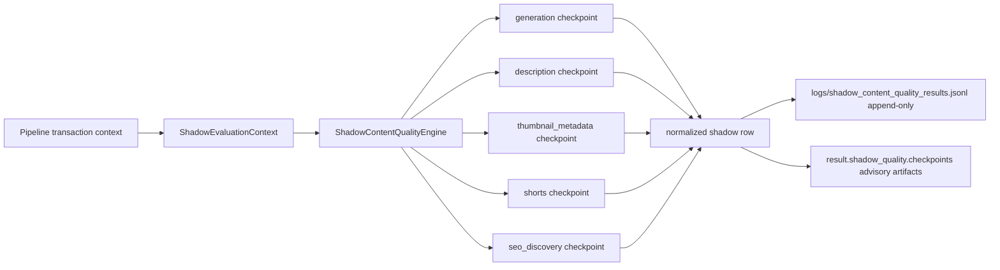

# PROJECT 001 - Slice 3 Phase 2 Shadow-Mode Content Quality Integration

## Objective

Implement a fully advisory, non-blocking content quality evaluation layer in pipeline shadow mode.

This phase preserves runtime behavior while adding deterministic quality signal capture for:
- generation
- description
- thumbnail metadata
- shorts
- seo/discovery

## Scope and Safety Constraints

This implementation is intentionally constrained to local, append-only, and fail-open behavior:
- no production deploy, no VPS actions, no release/push/merge operations
- no mutation of generated content in runtime path
- no auto-blocking, no regeneration, no queue rewrite side effects
- no phase 3 learning-loop execution

## Architecture

### New Module

File:
- src/shadow_content_quality.py

Main responsibilities:
- strict shadow flag parser: `CONTENT_QUALITY_SHADOW_MODE`
- immutable evaluation context: `ShadowEvaluationContext`
- checkpoint evaluator engine: `ShadowContentQualityEngine`
- append-only result storage and schema validation
- local historical lookup for duplicate detection

### Pipeline Integration

File:
- src/pipeline.py

Integration behavior:
- initializes shadow engine once per transaction when shadow mode is enabled
- runs checkpoint evaluations at deterministic integration points
- records each checkpoint outcome under `result.shadow_quality.checkpoints`
- logs structured summary events for success and isolated storage failures
- keeps pipeline fail-open even when evaluation/storage throws

### Data Flow

## Schema and Storage Contract

Shadow row schema version:
- `SHADOW_CONTENT_QUALITY_SCHEMA_VERSION` in src/shadow_content_quality.py

Primary fields (normalized/validated before persistence):
- evaluation metadata: evaluation_id, run_id, channel_id, content_id, checkpoint, executed_at
- validator metadata: validator_versions, history_window_size, history_malformed_lines
- scoring: overall_score, score_count, severity, scores[]
- findings: findings[] with code/severity/message/details
- safety flags: shadow_mode_enabled=true, pipeline_output_changed=false
- context metadata snapshot via `shadow_context` (sanitized, no full script/description payload)

Storage behavior:
- append-only JSONL writes via `append_shadow_row`
- strict row validation via `validate_shadow_row`
- tolerant reads via `load_shadow_results` (malformed line counting, no hard failure)

## Signals and Detection Coverage

Implemented signal families include:
- semantic consistency: title-script, title-thumbnail, description-script, shorts-title/script
- duplication/repetition: script similarity history checks, repetitive opener, repeated CTA
- risky finance wording: unsupported claim, insider claim, guaranteed return wording
- shorts quality: hook strength, payoff structure, duration signal, clipping indicators
- seo/discovery observability signals linked to playlist/title alignment heuristics

Severity calibration notes:
- semantic consistency checks that are noisy in shadow mode are intentionally capped to medium severity to reduce false alarms while still recording issues.
- severe risky-finance patterns remain high-severity findings.

## Failure Isolation Model

Failure isolation guarantees:
- evaluator exceptions do not fail pipeline transaction
- storage exceptions do not fail pipeline transaction
- checkpoint failures are logged and added to shadow checkpoint artifacts as non-fatal records
- shadow mode disabled path keeps baseline output unchanged

## Validation Matrix (Phase 2N)

Environment:
- Python 3.13.7
- local virtual environment: .venv-2

Executed validations and results:
1. Targeted Slice 3 + foundation suites
   - command: `python -m pytest -q tests/test_shadow_content_quality.py tests/test_pipeline_shadow_quality_integration.py tests/test_shadow_quality_evidence_scenarios.py tests/test_learning_foundation.py tests/test_analytics_feedback_store.py`
   - result: 41 passed
2. Related pipeline/quality/editor/uploader/scheduler suites
   - command: `python -m pytest -q tests/test_pipeline_quality_integration.py tests/test_pipeline_telemetry_fail_open.py tests/test_pipeline_experiment_registry_integration.py tests/test_content_quality_guard.py tests/test_editor_review.py tests/test_youtube_uploader_dns.py tests/test_scheduler_provider_guardrails.py tests/test_scheduler_topic_domain_guard.py tests/test_scheduler_shadow_mode.py tests/test_scheduler_singleton_lock.py tests/test_scheduler_cli.py`
   - result: 133 passed
3. Syntax compile check
   - command: `python -m compileall -q src tests`
   - result: pass
4. Full repository suite
   - command: `python -m pytest -q`
   - result: 738 passed

## Local Evidence Scenarios (Phase 2O)

Scenario artifact:
- artifacts/latest/project001_slice3_phase2_shadow_evidence.json

Scenario coverage count:
- 8 scenarios

Invariant validated:
- every scenario reports `pipeline_output_changed: false`

Observed severity distribution in local evidence run:
- medium: 5
- high: 3

## Limitations

Current phase limitations (intentional):
- no automatic remediation action is executed
- no model retraining or prompt rewrite loop
- no production telemetry promotion gates are enforced here
- heuristics are deterministic and may require future tuning against wider corpus

## Promotion Criteria (Advisory to Enforced)

Promotion to a future enforcement phase requires all of:
1. sustained shadow evidence across representative channels and topics
2. low false-positive rate with reviewed precision/recall thresholds
3. explicit rollback strategy and kill-switch coverage
4. production artifact evidence meeting maturity policy for PROVEN then VALIDATED

## Maturity Label

Current Slice 3 Phase 2 status: REPORTED

Rationale:
- implementation complete with deterministic local evidence
- broad local regression testing is green
- no production/runtime rollout evidence collected in this phase
