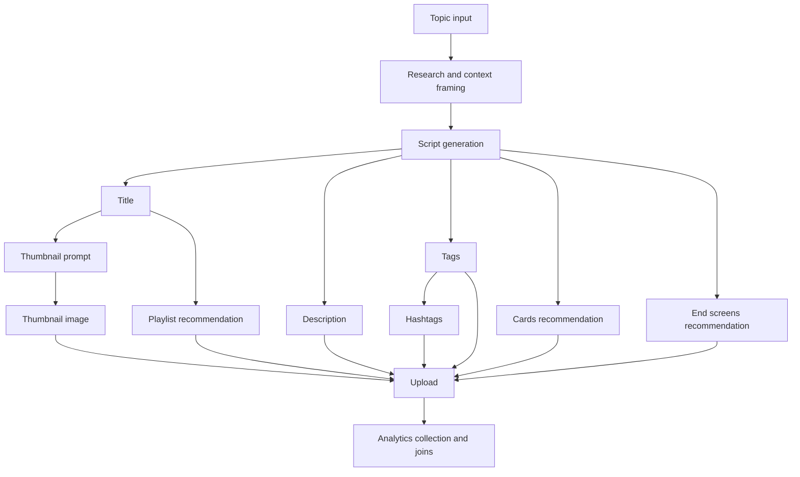
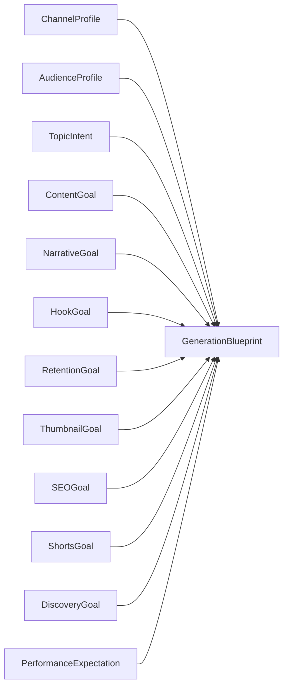

# PROJECT 001 - Slice 4 Phase 1 Content Intelligence Engine and Generation Planning Foundation

Label: LOCAL PLANNING FOUNDATION - NOT PRODUCTION VALIDATION

## Objective

Build immutable planning contracts so future generation can be intent-aware before creating content.

This phase is planning-only:
- no pipeline wiring
- no scheduler/upload behavior change
- no production feature enablement
- no metadata mutation

## Scope

Implemented in:
- [src/content_intelligence_foundation.py](src/content_intelligence_foundation.py)
- [tests/test_content_intelligence_foundation.py](tests/test_content_intelligence_foundation.py)

No production integration changes were made to:
- pipeline
- scheduler
- uploader
- live generation path

## Phase 1A - Current Generation Audit

### End-to-End Dependency Flow

### Stage Audit

1. Topic
- Inputs: scheduler topic or manual topic, channel niche/persona, prompt templates.
- Outputs: selected generation topic.
- Dependencies: [src/pipeline.py](src/pipeline.py), [src/content_generator.py](src/content_generator.py), channel config/registry.
- Prompts: anthropic-based topic and content system prompts in generator.
- Reusable components: domain validation, channel-topic alignment helpers.
- Randomness: candidate selection and model output variability.
- Deterministic logic: domain anchor checks and block/retry rules.
- Weaknesses: planning intent not explicit as structured contract pre-generation.

2. Research
- Inputs: selected topic, channel profile hints, fallback/retry guidance.
- Outputs: implicit model context (no explicit structured research object in phase path).
- Dependencies: content generator internals.
- Prompts: system persona and safety boundaries.
- Randomness: model synthesis variability.
- Deterministic logic: lexical safety/fit guard layers.
- Weaknesses: no typed research trace object for downstream planning.

3. Script
- Inputs: topic, guidance, channel prompt constraints.
- Outputs: script text and related content fields.
- Dependencies: [src/content_generator.py](src/content_generator.py), [src/pipeline.py](src/pipeline.py).
- Prompts: narrative/persuasion rules in generator prompt.
- Randomness: model output variability.
- Deterministic logic: fact-check and quality gates for retry/fail-open behavior.
- Weaknesses: hook/retention/narrative goals are implicit, not typed.

4. Title
- Inputs: generated content object, prompt rules.
- Outputs: title string.
- Dependencies: content generator and downstream validation.
- Randomness: model phrasing.
- Deterministic logic: guardrails and consistency validators.
- Weaknesses: no explicit CTR strategy model.

5. Thumbnail Prompt
- Inputs: generated content and optional experiment/diversity policy.
- Outputs: thumbnail prompt variants.
- Dependencies: [src/thumbnail_candidate_generator.py](src/thumbnail_candidate_generator.py), [src/thumbnail_selection_policy.py](src/thumbnail_selection_policy.py), [src/pipeline.py](src/pipeline.py).
- Randomness: variant generation and selection policy inputs.
- Deterministic logic: selection policy and metadata validation.
- Weaknesses: no explicit thumbnail psychology planning contract.

6. Thumbnail
- Inputs: prompt and image source (fetcher or generation path).
- Outputs: thumbnail artifact path.
- Dependencies: pipeline creator/fetcher and uploader integration.
- Randomness: source asset variance.
- Deterministic logic: validation and capability checks.
- Weaknesses: no structured authority/urgency/trust planning dimensions.

7. Description
- Inputs: generated content and SEO helper logic.
- Outputs: upload description text.
- Dependencies: generator + uploader sanitation in [src/youtube_uploader.py](src/youtube_uploader.py).
- Randomness: model phrasing.
- Deterministic logic: chapter and metadata sanitization.
- Weaknesses: no explicit search-vs-browse intent plan object.

8. Tags
- Inputs: generated tags.
- Outputs: sanitized tag list.
- Dependencies: uploader sanitization and quality scoring.
- Randomness: model tag choice.
- Deterministic logic: length/character sanitation.
- Weaknesses: no typed tag relevance plan object.

9. Hashtags
- Inputs: description/tag context.
- Outputs: hashtag strings in metadata path.
- Dependencies: metadata composition behavior.
- Randomness: model composition.
- Deterministic logic: sanitation.
- Weaknesses: no explicit hashtag strategy contract.

10. Playlist
- Inputs: content metadata and recommendation heuristics.
- Outputs: playlist recommendation metadata and/or post-upload handling.
- Dependencies: uploader helpers and observability states.
- Deterministic logic: capability gates and observability markers.
- Weaknesses: no typed discovery plan linkage.

11. Cards
- Inputs: content flow recommendations.
- Outputs: advisory recommendation states.
- Dependencies: shadow SEO observability / uploader capabilities.
- Weaknesses: no typed cards strategy in generation planning contract.

12. End Screens
- Inputs: recommendation context.
- Outputs: advisory recommendation states.
- Dependencies: SEO/discovery observability path.
- Weaknesses: no typed end-screen strategy contract.

13. Upload
- Inputs: video file, title/description/tags/thumbnail, privacy schedule.
- Outputs: video_id and upload telemetry.
- Dependencies: [src/youtube_uploader.py](src/youtube_uploader.py), upload precheck, capability gating.
- Randomness: network/API availability.
- Deterministic logic: retries, classification, sanitation, fail-open logging.
- Weaknesses: planning objective not enforced as pre-generation typed contract.

14. Analytics
- Inputs: upload outcomes and collector data.
- Outputs: analytics join metadata, snapshots, append-only records.
- Dependencies: [src/analytics_collector.py](src/analytics_collector.py), [src/analytics_join.py](src/analytics_join.py), [src/analytics_feedback_store.py](src/analytics_feedback_store.py).
- Deterministic logic: schema validation and append-only persistence.
- Weaknesses: no direct bridge from planning expectation to post-performance reconciliation contract.

## Phase 1B-1K: Content Intelligence Model Foundation

### Core Immutable Models

Implemented immutable serializable models:
- ChannelProfile
- AudienceProfile
- TopicIntent
- ContentGoal
- NarrativeGoal
- HookGoal
- RetentionGoal
- ThumbnailGoal
- SEOGoal
- ShortsGoal
- DiscoveryGoal
- PerformanceExpectation
- GenerationBlueprint

All models:
- use frozen dataclasses
- validate fields in __post_init__
- expose to_dict/from_dict
- include schema version checks

### Planning Flow

## Phase 1C - Channel Knowledge Model

Implemented channel profile builder:
- build_channel_profiles_from_registry
- source: [channels/channel_registry.json](channels/channel_registry.json)
- canonical IDs are preserved from registry entries
- exposes structured metadata for planning dimensions (niche, depth, cadence, ratios, CTA style)

No production behavior is hardcoded into runtime execution paths.

## Phase 1D - Topic Intelligence

TopicIntent supports categories:
- educational
- explanatory
- comparison
- breaking_news
- analysis
- myth_busting
- tutorial
- opinion
- evergreen
- trend
- warning
- update

Each TopicIntent carries:
- urgency
- expected CTR style
- expected retention style
- expected thumbnail style
- recommended narrative structure

## Phase 1E - Narrative Structure Library

Implemented reusable template catalog:
- default_narrative_templates

Templates include:
- curiosity loop
- problem -> solution
- myth -> reality
- timeline
- checklist
- ranking
- before / after
- mistake driven
- case study
- investigation
- story driven
- educational lecture

Planning-only objects; no script rewriting.

## Phase 1F - Hook Library

Implemented structured hook catalog:
- default_hook_templates

Hook types include:
- curiosity
- surprise
- contradiction
- warning
- question
- data_point
- emotional
- authority
- visual
- story

Each hook template includes:
- psychological intent
- ideal audience
- estimated retention objective

## Phase 1G - Retention Planning

RetentionGoal models:
- opening
- first 30 seconds
- curiosity refresh interval
- payoff timing
- CTA timing
- ending

Planning-only; no runtime mutation.

## Phase 1H - Thumbnail Psychology

ThumbnailGoal models:
- emotional emphasis
- facial emphasis
- object emphasis
- contrast
- information density
- text length target
- curiosity
- urgency
- trust
- authority

Planning-only; no image generation.

## Phase 1I - SEO Planning

SEOGoal models:
- title objective
- keyword strategy
- search intent
- browse intent
- suggested traffic objective
- playlist relevance plan
- tag relevance plan
- hashtag strategy

Planning-only; no metadata generation action.

## Phase 1J - Shorts Planning

ShortsGoal models:
- clip objective
- hook type
- context length
- payoff timing
- ending style
- looping suitability
- continuation suitability

Planning-only; no clipping change.

## Phase 1K - Generation Blueprint

GenerationBlueprint provides immutable combined contract across all planning dimensions.

Consistency checks available:
- assert_blueprint_planning_consistency

This is the future planning-to-generation contract. It is not connected to generator runtime in Phase 1.

## Tests (Phase 1L)

Added in [tests/test_content_intelligence_foundation.py](tests/test_content_intelligence_foundation.py):
- serialization roundtrip
- validation errors
- immutability
- schema evolution helper behavior
- backward compatibility defaults
- blueprint construction
- planning consistency checks
- channel profile registry validation
- topic intent validation
- hook validation
- retention validation
- narrative/hook library coverage

## Future Integration Points

Planned (not implemented in Phase 1):
- generator accepts GenerationBlueprint as input contract
- prompt assembly derived from blueprint attributes
- post-run analytics mapped back to PerformanceExpectation
- per-channel blueprint policy overlays

## Limitations

- local planning foundation only
- no production integration
- no prompt evolution in this phase
- no automatic metadata/content generation changes
- no scheduler/upload behavior modification
- no enforcement logic

## Promotion Roadmap

Before moving to Slice 4 Phase 2 operational integration:
1. keep schema stable and versioned
2. define blueprint selection strategy per channel
3. add migration tests for future schema versions
4. add non-invasive shadow integration path
5. require explicit human approval before runtime adoption

Current maturity label:
- REPORTED (local implementation + tests)
- not PROVEN/VALIDATED in production
