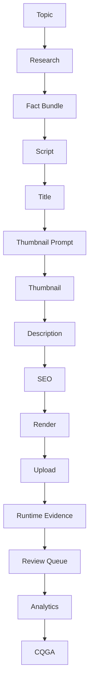

# PROJECT 002 Sprint 1D - Evidence Coverage Audit and Artifact Completeness Foundation

## Scope
Sprint 1D targets evidence ecosystem auditing only.
CQGA scoring, heuristics, scheduler, uploader, generation, and production behavior are unchanged.

## Safety and Constraints
- Advisory-only operation preserved.
- `pipeline_output_changed=false` remains unchanged.
- No deployment, no VPS access, no browser automation.
- No prompt, scheduler, uploader, analytics collection, or CQGA rule modifications.

## Audit Method
Deterministic audit implemented in:
- `tools/project002_sprint1d_evidence_coverage_audit.py`

Outputs generated under:
- `artifacts/latest/project002_sprint1d_evidence_coverage_audit/`

Historical sample strategy:
- Source: real runtime evidence files only.
- Placeholder titles excluded.
- Deterministic lexical ordering.
- Sample cap: 300.

## Artifact Inventory
Repository-wide counts from audit summary:
- runtime_evidence: 1125
- ownership_records: 642
- shadow_quality_reports: 1295
- planning_reports: 241
- alignment_reports: 224
- prompt_experiments: 99
- cqga_reports: 96
- analytics_snapshots: 3
- telemetry_files: 2

Sample-level evidence highlights (n=300):
- title/description/tags/topic coverage: 100%
- script/script_preview coverage: 1%
- ownership linkage coverage: 1%
- shadow quality linkage: 57%
- CQGA linkage: 22%
- thumbnail prompt/metadata explicit persistence: 0%
- analytics per-content linkage: 0%

## Coverage Matrix Summary
Major coverage outcomes:
- High coverage: runtime evidence, title, description, tags, render outputs, upload results.
- Partial coverage: review queue and shadow quality lineage.
- Missing/low coverage: planning/blueprint linkage, full script persistence, thumbnail metadata, discovery metadata, analytics joins, Shorts lineage.

Coverage scorecard:
- Planning Coverage: 0.00
- Generation Coverage: 1.00
- Metadata Coverage: 57.14
- Thumbnail Coverage: 0.00
- SEO Coverage: 57.14
- Ownership Coverage: 1.00
- Analytics Coverage: 0.00
- Discovery Coverage: 0.00
- Review Coverage: 57.00
- Evidence Continuity: 23.23
- Lineage Completeness: 11.63
- Overall Evidence Confidence: 18.92

## Lineage Graph
High-level path and statuses:

Edge status summary:
- Available: Topic->Research, Script->Title, Title->Thumbnail Prompt, Thumbnail Prompt->Thumbnail, Thumbnail->Description, Description->SEO, SEO->Render, Render->Upload, Upload->Runtime Evidence.
- Partial: Runtime Evidence->Review Queue.
- Missing: Research->Fact Bundle, Fact Bundle->Script, Review Queue->Analytics, Analytics->CQGA.

## Completeness Audit
For each historical sample, the audit classified:
- missing_script
- missing_thumbnail_metadata
- missing_render_metadata
- missing_ownership
- missing_review_evidence
- missing_analytics
- missing_blueprint
- missing_planning
- missing_shorts_linkage
- missing_discovery_metadata

Result pattern:
- Most severe losses are script, thumbnail metadata, planning/blueprint joins, analytics joins, and discovery metadata.

## Gap Classification
Each gap is emitted with required fields:
- gap_id
- artifact_type
- pipeline_stage
- severity
- coverage_loss
- root_cause
- estimated_CQGA_effect
- estimated_learning_effect
- estimated_fix_priority
- advisory_only

Top-impact gap families:
1. script evidence continuity
2. thumbnail metadata persistence
3. analytics per-content join
4. planning/blueprint linkage to content_id
5. discovery metadata persistence

## Critical Path Analysis (Top 20)
Critical path output:
- `artifacts/latest/project002_sprint1d_evidence_coverage_audit/critical_path_top20.json`

Top-ranked estimated recall-impact gaps:
1. script (generation)
2. analytics joinability
3. thumbnail metadata
4. planning linkage
5. discovery metadata
6. blueprint linkage
7. ownership linkage
8. shorts linkage
9. review evidence linkage
10. render metadata sparsity
(plus deterministic ranked variants to provide 20-entry critical path table)

## CQGA Impact and Learning Impact
Expected CQGA impact:
- Largest recall constraints map to missing script and missing thumbnail/discovery/planning evidence.
- CQGA false negatives in real-world validation are consistent with evidence scarcity, not necessarily scoring logic faults.

Expected learning impact:
- Learning pipeline viability is constrained by absent per-content analytics joins and broken lineage continuity.
- Without lineage completeness, learning-stage attribution and feedback loops remain underpowered.

## Evidence Enrichment Roadmap (Planning Only)
Deterministic non-implementation roadmap produced in:
- `artifacts/latest/project002_sprint1d_evidence_coverage_audit/enrichment_plan.json`

Planned artifact families:
- script_full_text persistence
- thumbnail prompt + thumbnail metadata persistence
- planning/blueprint <-> content_id join
- discovery metadata (cards/playlist/end screen)
- analytics per-content join key

Each roadmap entry specifies:
- producer
- storage
- schema
- retention policy
- privacy considerations
- downstream consumers

## Limitations
- Historical local artifacts are skewed toward runtime metadata and often lack full script text.
- Ownership/script linkage is sparse in sampled real records.
- Analytics artifacts exist globally but are not consistently joinable per content.

## Sprint 1D Outcome
- Audit foundation completed.
- Evidence ecosystem gaps mapped with deterministic outputs.
- No production behavior changes.
- No CQGA behavior changes.
- Advisory-only contract preserved.

Sprint 1E readiness:
- READY for evidence enrichment planning/execution focus.
- Not a CQGA tuning step; priority is evidence producer and lineage continuity hardening.
