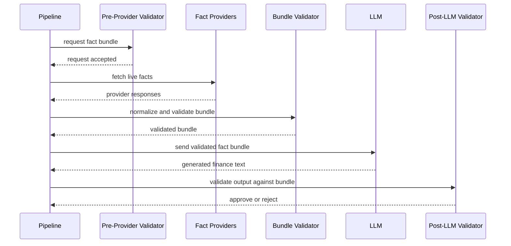

# ADR 0002: Fact Bundle Engine Design

## Context

Finance channels now use a factual freshness guard to block stale or unverified live numbers before publication. That guard solves the immediate risk, but the architecture still needs a durable boundary for finance data handling. The next step is a dedicated Fact Bundle Engine that centralizes live data acquisition, validation, caching, and delivery to the LLM.

The design goal is simple: the pipeline owns live facts, and the LLM only verbalizes validated bundles.

## Decision

Finance content will be built around validated fact bundles.

- The pipeline is the authority for live market data.
- The LLM may describe facts, but may not originate live numerical claims.
- Every finance script must consume a validated fact bundle, not raw provider responses.
- Historical and current facts must be explicit at the fact level.

## Bundle Schema

Each bundle must include the following required fields:

- `schema_version`: bundle schema version
- `bundle_id`: stable unique identifier
- `created_at`: bundle creation timestamp
- `expires_at`: bundle expiry timestamp
- `source_status`: summary of provider health and availability
- `facts[]`: normalized fact records
- `validation_status`: bundle-level validation result

## Fact Schema

Each fact in `facts[]` must include:

- `key`: canonical fact key, such as `usd_try`
- `value`: normalized fact value
- `unit`: currency, percent, index, or other explicit unit
- `source`: provider name or source identifier
- `collected_at`: source capture timestamp
- `confidence`: confidence score or confidence class
- `volatility`: low, medium, or high
- `historical/current`: explicit temporal classification
- `ttl`: fact-level time-to-live

## Provider Architecture

The provider layer should be interface-driven and multi-source by default.

### Provider Interface

Providers should expose a small contract for fetching canonical facts, reporting freshness, and returning structured errors.

### Multi-Provider Strategy

- Use more than one trusted provider for important live facts.
- Prefer deterministic provider ordering.
- Normalize provider outputs into the same fact model before validation.

### Fallback Chain

- Attempt the primary provider first.
- If the primary fails or returns stale data, consult the next provider.
- Stop when a valid fact bundle can be built or the chain is exhausted.

### Quorum Rules

- For high-risk or high-volatility facts, require agreement between multiple providers when feasible.
- For lower-risk facts, a single trusted provider may be sufficient if the freshness and validation rules pass.

### Timeout Policy

- Each provider call must have a bounded timeout.
- Timeouts should be short enough to protect generation latency.
- A timed-out provider counts as unavailable for that request.

## Validation Pipeline

Validation must happen in layers so failure modes are visible and local.

1. Pre-provider validation
   - Check request shape, supported keys, and allowed source set.
   - Reject obviously invalid or unsupported fact requests early.

2. Provider validation
   - Validate provider payload shape, freshness, and parseability.
   - Reject malformed or stale provider responses.

3. Bundle validation
   - Ensure required bundle fields are present.
   - Confirm internal consistency across facts, timestamps, units, and source status.

4. Pre-LLM validation
   - Confirm only validated facts will be exposed to the LLM.
   - Block generation if the bundle is incomplete, stale, or untrusted.

5. Post-LLM validation
   - Check that the generated text stayed within the supplied bundle.
   - Reject invented live numbers, unsupported claims, or missing historical labels.

## Cache Strategy

The Fact Bundle Engine should cache validated bundles to reduce repeated provider calls.

- TTL: cache bundles only for their valid freshness window.
- Stale handling: stale bundles may be reused only for degraded non-live summaries, never for exact live numbers.
- Cache invalidation: invalidate on expiry, source failure, or validation rule changes.

## Failure Policy

The failure mode depends on the content path.

- Fail-open: non-finance or qualitative content may continue without exact live numbers.
- Fail-closed: finance content that requires exact live numbers must stop when validation fails.
- Retry: provider timeouts and transient fetch failures may retry within bounded limits.
- Degraded mode: if no valid bundle exists, the pipeline may generate qualitative copy without exact live figures.

## Sequence Diagram

## Migration Plan From Current Factual Freshness Guard

The current factual freshness guard should become the first enforcement layer inside the new engine rather than a standalone endpoint.

1. Keep the existing guard behavior as the initial pre-LLM validation rule.
2. Move live data acquisition into the provider layer.
3. Introduce bundle assembly and schema validation around the current guard.
4. Add post-LLM validation so generated text is checked against the bundle, not only against source freshness.
5. Gradually route finance generation paths to the Fact Bundle Engine while keeping the fail-closed behavior already in place.

## Consequences

- Live finance facts become centralized and auditable.
- The system can support multiple trusted providers without changing generation logic.
- Validation becomes explicit at each boundary.
- Finance generation becomes safer, but slightly more complex to orchestrate.

## Non-goals

- Implementing provider adapters in this document.
- Changing non-finance content generation.
- Designing a general-purpose market analytics platform.
- Exposing live provider APIs directly to the LLM.

## Future Implementation Notes

- Start with a small canonical fact set such as FX, rates, and major crypto prices.
- Keep bundle and fact schemas versioned from day one.
- Emit structured validation metadata so failures are easy to debug.
- Prefer deterministic provider ordering and deterministic bundle creation.