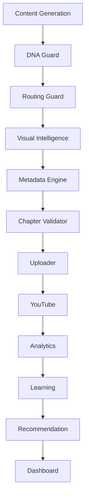

# Architecture Overview

## Goal
Build a resilient Autonomous Media Operating System that grows autonomy without
breaking production stability.

## Current Operating Model

Two tracks run in parallel:

1. Production Track
- Existing production assets remain stable.
- No automatic destructive actions.
- No uncontrolled publication behavior.

2. Passive Research Track
- Collects and stores observations.
- Uses append-only event files.
- Supports replay for analysis and backtesting.
- Does not perform scoring-based decisions in production.

## Passive Research Components

- Collector contract:
  - source
  - schema_version
  - observed_at
  - raw
- Passive collectors:
  - google_trends
  - github_trends
  - reddit_trends
- Append-only event store:
  - research/raw/YYYY-MM-DD.jsonl
  - research/normalized/opportunities.jsonl
  - research/schema/opportunity_v1.json
- One-shot scheduler:
  - runs registered collectors once
  - fail-open per collector
  - returns structured summary
- Replay engine:
  - line-by-line JSONL reading
  - fail-open invalid JSON lines
  - filters by source, schema_version, observed_at range
  - metadata summary (files and observed_at bounds)

## Why Replay Matters

Replay enables:
- backtesting on historical observations
- safe scoring iteration without recollecting internet data
- reproducible debugging
- deterministic regression checks

## Non-goals in Current Phase

- automatic channel launch
- scoring-based automatic decisions
- backlog auto-generation
- production publishing logic changes

## Architecture and Data Flow Map

| Layer | Owner | Primary Artifact | Evidence | Tests | Rollout |
| --- | --- | --- | --- | --- | --- |
| Content Generation | Content Platform | output/content_*.json | logs/channel_performance.jsonl | tests/test_content_generator_prompting.py | Active |
| DNA Guard | Platform Safety | logs/dna_guard_latest.json | logs/session_evidence_*.md | tests/test_pipeline_telemetry_fail_open.py | Observation-only |
| Routing Guard | Orchestration | channels/channel_registry.json | logs/activation_controller_report.json | tests/test_pipeline_telemetry_fail_open.py | Observation-only |
| Visual Intelligence | Thumbnail System | output/thumbnails/* | logs/channel_performance.jsonl | tests/test_thumbnail_selection_policy.py | Shadow |
| Metadata Engine | Metadata Platform | logs/metadata_repair_*.json | logs/metadata_repair_pending_oauth*.json | tests/test_metadata_repair.py | Active |
| Chapter Validator | Upload Safety | logs/chapter_validator_latest.json | logs/chapter_validation_trail.jsonl | tests/test_chapter_validator.py | Active (guardrail) |
| Uploader | Publishing Platform | logs/chapter_validation_trail.jsonl | logs/production_scheduler.pid | tests/test_youtube_uploader_dns.py | Controlled |
| YouTube | External Platform | n/a | API response IDs and error trails | tests/test_youtube_uploader_dns.py | External |
| Analytics | Analytics Platform | logs/analytics_*.json | logs/analytics_oauth_backlog_priority_*.txt | tests/test_pipeline_telemetry_fail_open.py | Observation-only |
| Learning | Optimization Platform | docs/experiment_registry_schema.md | logs/channel_performance.jsonl | tests/test_pipeline_telemetry_fail_open.py | Shadow |
| Recommendation | Optimization Platform | docs/selection_policy_v2_design.md | logs/channel_performance.jsonl | tests/test_thumbnail_selection_policy.py | Shadow |
| Dashboard | Governance | docs/governance_readiness_latest.md | logs/activation_controller_report.json | tests/test_pipeline_telemetry_fail_open.py | Observation-only |

## Critical Infrastructure Debt

- Governance artifact production is not yet single-sourced. `ops/refresh_governance_readiness.py` is the canonical refresh entrypoint, but some subordinate report producers are currently absent from the repo tree.
- As a result, refresh can still succeed through artifact fallback for `p0_validation_metrics`, `p0_p1_artifact_bundle`, and `executive_dashboard` when prior artifacts already exist.
- This is acceptable as a containment measure, not as an end state. The target state is one canonical producer per artifact with no silent fallback-based PASS for required evidence.
